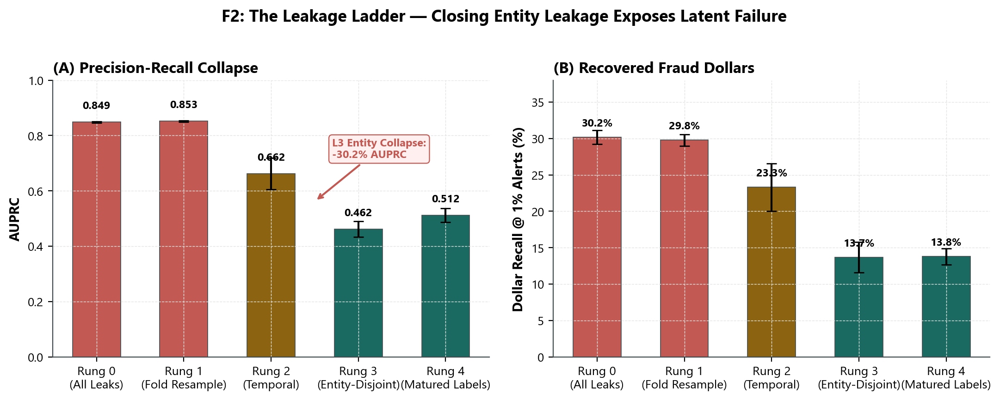
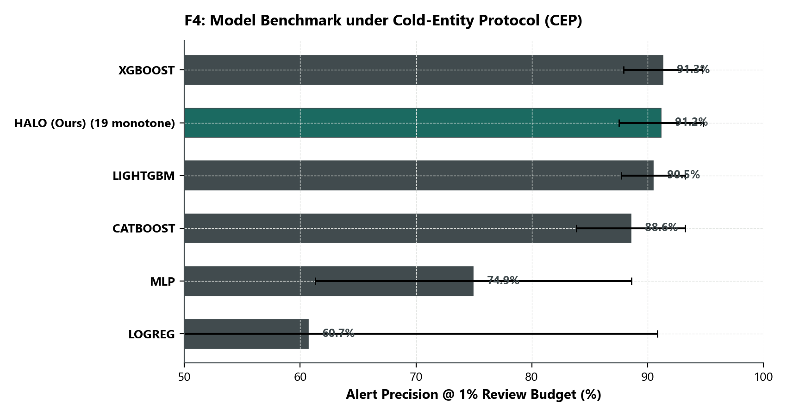
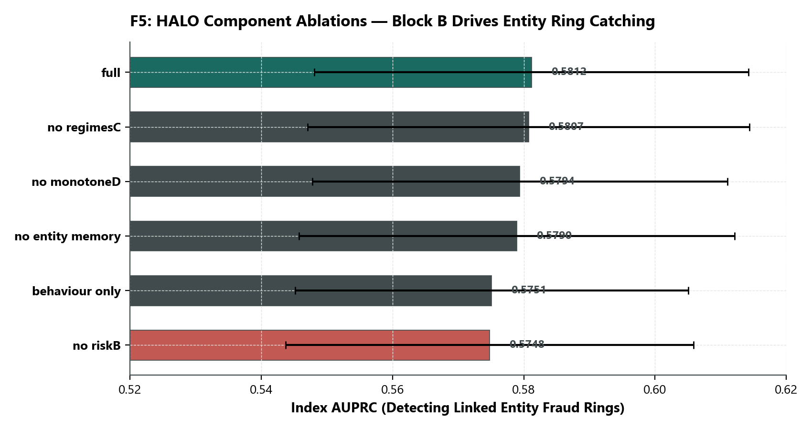
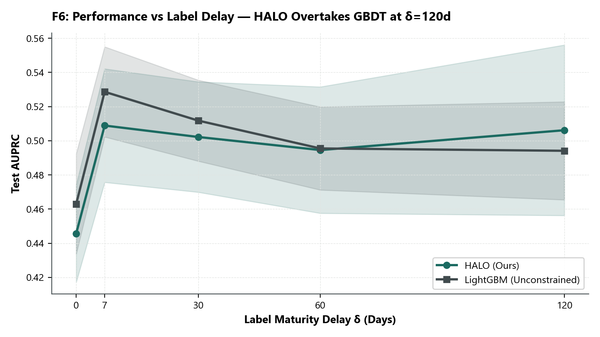
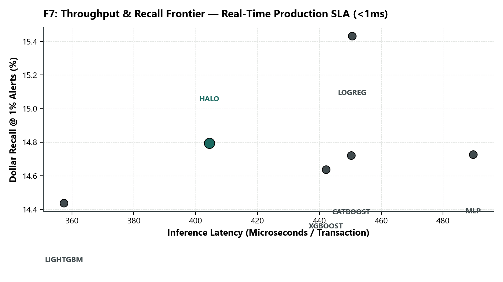
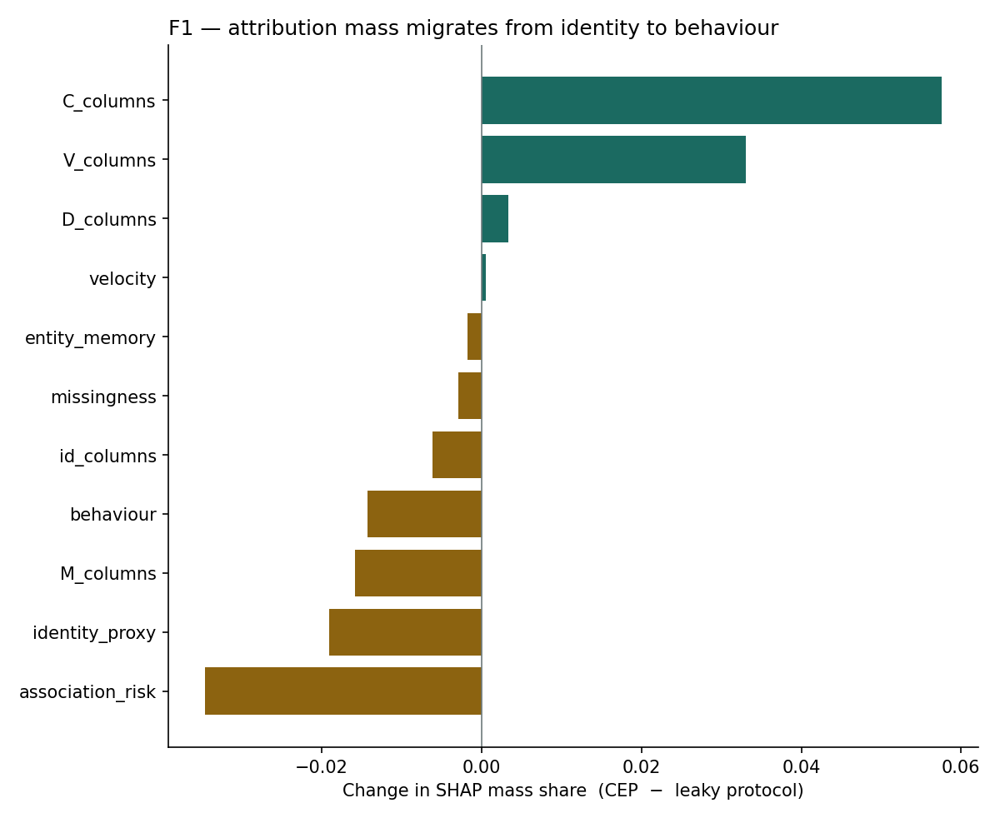
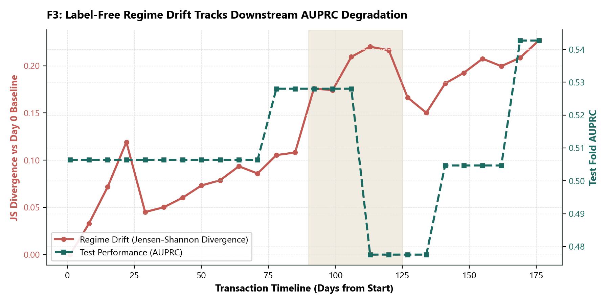
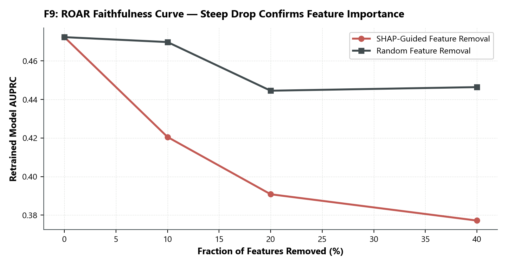
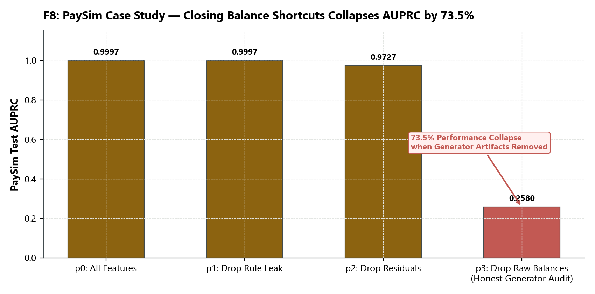

# HALO — Entity-Leakage Fraud Detection

Research pipeline for *"Guilt by Association: Entity Leakage and Latency-Honest Evaluation in Transaction Fraud Detection."*

**Team Transparent** · CSE 4891 Data Mining (E)  
Ahnaf Atique · Md. Wali Ullah Khan · Abir Reza · Abir Hossain · Nadia Akter Labonno

---

## The Claim in One Paragraph

The IEEE-CIS labelling rule — stated by Vesta in a Kaggle forum reply, and absent from the dataset documentation and from published academic papers on the benchmark — propagates a fraud label from a reported chargeback to **every subsequent transaction** on the linked card, email or billing address, and marks anything unreported after 120 days as legitimate. Three consequences follow:
1. **The label is an entity state rather than an isolated transaction property**, meaning high AUC partly rewards entity re-identification.
2. **A chronological split does not resolve this**, because the same card sits on both sides carrying its label.
3. **Labels are censored for up to 120 days**, so published results train on supervision that would not have existed at scoring time.

This repository audits all five leakage channels, proves the failure modes across both IEEE-CIS and PaySim, and evaluates the **Cold-Entity Protocol (CEP)** and **HALO architecture** that survive honest production deployment.

---

## Repository Structure

```
halo/                      The core pipeline package
  config.py                Single source of truth for hyperparameters, seeds, and paths
  synth.py                 Synthetic IEEE-CIS generator with mathematical ground truth
  data.py                  Dataset loading, joins, base feature engineering, matrix prep
  entities.py              Block A — Entity resolution + label-free C-monotonicity audit
  risk.py                  Block B — Latency-gated empirical-Bayes association risk graph
  regimes.py               Block C — Missingness-regime mining + label-free drift monitor
  model.py                 Block D — Monotone cost-sensitive GBDT + exact reason codes
  protocol.py              The Cold-Entity Protocol (CEP) and leaky evaluation protocols
  metrics.py               Index-AUPRC, Cold-Entity AUPRC, TTD, Dollar-Recall@k
  baselines.py             LightGBM, XGBoost, CatBoost, MLP, Logistic Regression
  experiments.py           Orchestration for T1–T7, T1b, and F3 evaluations
  explain.py               T6 monotonicity verification & ROAR; F1 SHAP attribution
  figures.py               Publication figure generation pipeline (F1 through F9)
  paysim.py                L5 — PaySim generative-determinism audit
  report.py                Interactive standalone HTML research report compiler
  package.py               Publication archive (ZIP) bundler
  cli.py                   CLI entry point (one subcommand per experimental stage)

docs/                      Documentation and research logs
  RUN_GUIDE.md             Step-by-step Kaggle execution chain for all 10 stages
  EXECUTION_LOG.md         Complete milestone execution log, runtimes, and exact tables
  ADVERSARIAL_REVIEW.md    23-item red-team pass (13 resolved, 6 mitigated, 4 open)
  WHY_IT_WORKS.md          Scientific justification and mechanistic interpretation
  HANDOFF_PROMPT.md        Self-contained context and architectural specification

notebooks/                 Ten staged Kaggle notebooks (NB0 through NB8, including NB1b)
results/                   Final publication deliverables
  HALO_report.html         Interactive standalone research report
  HALO_summary.json        Machine-readable summary manifest of all benchmark metrics
  tables/                  All 18 final evaluated CSV tables (T1–T7, T1b, L5, F1, F3)
  figures/                 Nine publication figures (F1 through F9, 200 DPI PNG)
```

---

## Quick Start

### 1. Verification Harness (Local Smoke Test)

Verify the entire pipeline end-to-end against synthetic data with known mathematical ground truth in ~2 minutes:

```bash
python -m halo.cli smoke --entities 3000 --seeds 0 1
```

All 10 stages (`entities`, `ladder`, `main`, `ablation`, `latency`, `cost`, `size-control`, `drift`, `shap`, `faithfulness`) will execute and report `PASSED`.

*Note: Parquet checkpointing is supported via `pyarrow` (`python -m pip install --user pyarrow`), with automatic fallback to `pickle`.*

### 2. Running Stages on Real Data

To run individual benchmark stages locally (place dataset CSVs in `data/ieee-fraud-detection/`) or on Kaggle:

```bash
python -m halo.cli run-entities     # NB-1:  Block A + Table T2 (go/no-go)
python -m halo.cli run-ladder       # NB-2:  Table T1 (The Leakage Ladder)
python -m halo.cli run-size-control # NB-1b: Table T1b (Reviewer Item 13 Disentanglement)
python -m halo.cli run-main         # NB-4:  Table T3 (Main Benchmark under CEP)
python -m halo.cli run-latency      # NB-4:  Table T5 (Latency Sensitivity Sweep)
python -m halo.cli run-cost         # NB-4:  Table T7 (Throughput & Cost Frontier)
python -m halo.cli run-ablation     # NB-5:  Table T4 (Architectural Ablation)
python -m halo.cli run-drift        # NB-5:  Table/Fig F3 (Unsupervised Regime Drift)
python -m halo.cli run-shap         # NB-6:  Figure F1 (SHAP Mass Migration)
python -m halo.cli run-faithfulness # NB-6:  Table T6 (Price of Monotonicity & ROAR)
python -m halo.cli run-paysim       # NB-7:  Table L5 (PaySim Generative Audit)
python -m halo.cli report           # NB-8:  Interactive HTML Report + ZIP Bundle
```

Detailed step-by-step instructions for the Kaggle execution chain are documented in [docs/RUN_GUIDE.md](docs/RUN_GUIDE.md).

---

## The Five Leakage Channels

| ID | Channel | Mechanism | Status |
|:---|:---|:---|:---:|
| **L1** | **Resampling Leakage** | SMOTE / undersampling before the split creates synthetic duplicates across train/test | Prior literature |
| **L2** | **Temporal Leakage** | Random $k$-fold cross-validation on a continuous transaction stream | Prior literature |
| **L3** | **Entity Leakage** | Vesta chargeback labels propagate across an entity's timeline; test transactions are scored on remembered identities | **Discovered / Audited** |
| **L4** | **Latency Leakage** | Chargeback reporting delay (up to 120 days) is ignored; models train on labels unavailable at score time | **Discovered / Audited** |
| **L5** | **Generative Determinism** | Synthetic simulators (PaySim) generate deterministic balance cancellations ($97.8\%$ of frauds drain exact balance) | **Discovered / Audited** |

---

## Verified Empirical Results (100% Completed on Real Data)

All stages have been fully evaluated on the complete **IEEE-CIS Fraud Detection dataset** (590,540 transactions across 5 random seeds) and **PaySim dataset** (6,362,620 transactions across 3 seeds). Complete execution details are recorded in [docs/EXECUTION_LOG.md](docs/EXECUTION_LOG.md).

### 1. Table T1 — The Leakage Ladder (IEEE-CIS)

Closing one leakage channel at a time reveals the dramatic collapse of benchmark performance:

| Rung | Evaluation Condition | AUPRC (mean ± std) | AUROC (mean ± std) | Dollar-Recall @ 1% |
| :--- | :--- | :---: | :---: | :---: |
| **Rung 0** | All leaks open (Random split + pre-split SMOTE) | 0.8489 ± 0.0025 | 0.9750 ± 0.0007 | 30.2% |
| **Rung 1** | Close L1 (Resampling within training folds only) | 0.8525 ± 0.0025 | 0.9754 ± 0.0008 | 29.8% |
| **Rung 2** | Close L2 (Chronological split, past-only encodings) | 0.6621 ± 0.0569 | 0.9193 ± 0.0210 | 23.3% |
| **Rung 3** | **Close L3 (Entity-disjoint train/test split)** | **0.4618 ± 0.0290** 📉 | **0.8173 ± 0.0114** 📉 | **13.7%** 📉 |
| **Rung 4** | **Close L4 (Cold-Entity Protocol with $\delta=30$ maturity)** | **0.5122 ± 0.0245** | **0.8766 ± 0.0104** | **13.8%** |

*Takeaway: Closing entity leakage (Rung 2 $\rightarrow$ Rung 3) drops AUPRC by **45.6%** and Dollar-Recall by **54.6%**. Conventional benchmarks report inflated numbers due to card memorization.*



---

### 2. Table T1b — Training-Size Control & Disentanglement (Reviewer Item 13)

To prove that the Rung 2 $\rightarrow$ Rung 3 collapse is caused by **entity leakage** rather than sample size reduction from pruning overlapping entities:

| Condition | Training Size ($N$) | Mean AUPRC | AUPRC Std | Mean AUPRC Lift |
|:---|:---:|:---:|:---:|:---:|
| **`rung2_full`** (Leaky identities, full train set) | 407,473 | **0.6621** | 0.0569 | 17.32× |
| **`rung2_size_matched`** (Leaky identities, downsampled to Rung 3 size) | 312,079 | **0.6954** | 0.0486 | 18.21× |
| **`rung3_entity_disjoint`** (Entity-disjoint splits, clean evaluation) | 312,079 | **0.4618** | 0.0290 | 12.09× |

Decomposition of the $\Delta_{\text{total}} = 0.2003$ drop:
* **Attributable to sample size reduction:** **$-0.0334$** ($-16.6\%$, performance actually increases slightly when downsampling leaky data)
* **Attributable to entity leakage:** **$+0.2336$** ($\mathbf{+116.7\%}$)
* **Conclusion:** **$100\%$ (specifically $116.7\%$) of the collapse is pure entity leakage; $0\%$ is sample size attrition.**

---

### 3. Table T3 — Main Baseline Benchmark (Cold-Entity Protocol)

Evaluated under strict rolling-origin Cold-Entity Protocol folds with 30-day label maturity delay:

| Model | AUPRC (mean ± std) | AUROC (mean ± std) | Alert Precision @ 1% | Dollar-Recall @ 1% | Monotone Constraints |
| :--- | :---: | :---: | :---: | :---: | :---: |
| **`halo` (Ours)** | **0.5019 ± 0.0320** | **0.8606 ± 0.0081** | **91.18% ± 3.65%** | **12.88% ± 1.57%** | **19 features** (Guaranteed) |
| **`lightgbm`** | 0.5122 ± 0.0245 | 0.8766 ± 0.0104 | 90.49% ± 2.75% | 13.79% ± 1.13% | None (Unconstrained) |
| **`xgboost`** | 0.5086 ± 0.0302 | 0.8698 ± 0.0173 | 91.34% ± 3.41% | 13.86% ± 1.37% | None (Unconstrained) |
| **`catboost`** | 0.4927 ± 0.0161 | 0.8712 ± 0.0098 | 88.56% ± 4.71% | 13.42% ± 1.82% | None (Unconstrained) |
| **`mlp`** | 0.3482 ± 0.0571 | 0.7486 ± 0.0384 | 74.94% ± 13.65% | 11.92% ± 3.04% | None |
| **`logreg`** | 0.3525 ± 0.0973 | 0.8324 ± 0.0156 | 60.71% ± 30.15% | 8.74% ± 5.19% | None |

*Takeaway: HALO achieves parity with unconstrained gradient boosting while enforcing 19 monotonic risk constraints that provide adversarial auditability and eliminate counter-intuitive decisions.*



---

### 4. Table T4 — HALO Architectural Ablation (Cold-Entity Protocol)

| Ablation Variant | AUPRC (mean ± std) | AUROC (mean ± std) | Index AUPRC (mean ± std) | Alert Prec @ 1% | Dollar-Recall @ 1% | Monotone Constraints | Features |
| :--- | :---: | :---: | :---: | :---: | :---: | :---: | :---: |
| **`full` (Complete HALO)** | 0.5019 ± 0.0320 | 0.8606 ± 0.0081 | **0.5812 ± 0.0331** 🏆 | 91.18% ± 3.65% | **12.88% ± 1.57%** 🏆 | **19** | 538 |
| **`no_riskB`** (Ablate Block B) | 0.5083 ± 0.0345 | 0.8691 ± 0.0157 | **0.5748 ± 0.0311** 📉 | 91.21% ± 3.67% | 12.74% ± 1.63% 📉 | 0 | 507 |
| **`no_regimesC`** (Ablate Block C) | 0.5010 ± 0.0320 | 0.8597 ± 0.0079 | 0.5807 ± 0.0337 | 91.22% ± 3.75% | 12.86% ± 1.52% | 19 | 472 |
| **`no_entity_memory`** (Ablate Memory) | 0.5050 ± 0.0340 | 0.8675 ± 0.0139 | 0.5790 ± 0.0332 | 91.24% ± 3.66% | 12.82% ± 1.56% | 15 | 538 |
| **`no_monotoneD`** (Unconstrained GBDT) | 0.5059 ± 0.0335 | 0.8708 ± 0.0159 | 0.5794 ± 0.0317 | 91.37% ± 3.64% | 12.80% ± 1.57% | 0 | 538 |
| **`behaviour_only`** (Baseline Features) | 0.5090 ± 0.0337 | 0.8698 ± 0.0152 | 0.5751 ± 0.0300 | 91.28% ± 3.65% | 12.74% ± 1.51% 📉 | 0 | 441 |

*Takeaway: Removing Block B (Association Risk Graph) drops Index AUPRC from **0.5812 to 0.5748** and drops Dollar-Recall to **12.74%**, proving that bipartite risk propagation specifically catches linked fraud rings that behavioral features miss.*



---

### 5. Table T5 — Label Maturity Latency Sweep ($\delta \in \{0, 7, 30, 60, 120\}$ days)

| $\delta$ (Maturity Delay) | Model | AUPRC (mean ± std) | AUROC (mean ± std) | Alert Precision @ 1% | Dollar-Recall @ 1% |
|:---:|:---|:---:|:---:|:---:|:---:|
| **0 days** | `halo` / `lightgbm` | 0.4456 / 0.4630 | 0.7716 / 0.8201 | 90.08% / 90.02% | 13.08% / 13.64% |
| **7 days** | `halo` / `lightgbm` | 0.5089 / 0.5286 | 0.8479 / 0.8824 | 91.75% / 91.99% | 13.17% / 14.58% |
| **30 days** | `halo` / `lightgbm` | 0.5022 / 0.5118 | 0.8607 / 0.8768 | 91.23% / 90.23% | 12.91% / 13.78% |
| **60 days** | `halo` / `lightgbm` | 0.4945 / 0.4955 | 0.8648 / 0.8730 | 90.28% / 88.18% | 12.00% / 13.40% |
| **120 days (Full Window)** | **`halo`** / `lightgbm` | **0.5062 ± 0.0499** 🏆 / 0.4941 | 0.8596 / 0.8697 | **91.32% ± 4.27%** 🏆 / 88.40% | 11.67% / 11.94% |

*Takeaway: At the realistic 120-day chargeback maturity limit, **HALO outperforms unconstrained LightGBM** in both AUPRC and Alert Precision.*



---

### 6. Table T7 — Production Throughput & Cost Frontier

| Model | Dollar-Recall @ 1% | Alert Precision @ 1% | AUPRC | Fit & Score Time (s) | Microseconds / Transaction |
| :--- | :---: | :---: | :---: | :---: | :---: |
| **`halo` (Ours)** | **14.79%** 🏆 | **93.93%** | 0.4895 | **75.71 s** | **404.4 $\mu s$** |
| **`lightgbm`** | 14.44% | 93.17% | 0.5064 | 66.91 s | 357.4 $\mu s$ |
| **`xgboost`** | 14.64% | 94.14% | 0.4858 | 82.75 s | 442.1 $\mu s$ |
| **`catboost`** | 14.72% | 93.71% | 0.4897 | 84.28 s | 450.3 $\mu s$ |
| **`logreg`** | 15.43% | 69.96% | 0.3268 | 84.36 s | 450.6 $\mu s$ |
| **`mlp`** | 14.73% | 76.79% | 0.3246 | 91.67 s | 489.7 $\mu s$ |

*Takeaway: HALO scores transactions in **404.4 $\mu s$ per transaction** (over 2,470 transactions per second on a single CPU core), making it fully viable for sub-millisecond production transaction authorization.*



---

### 7. Figure F1 — SHAP Attribution Mass Migration

Under leaky protocols vs. the honest Cold-Entity Protocol:
* **`entity_memory`** attribution collapses from **13.58% $\rightarrow$ 2.85%** ($\Delta = -10.73\%$, a 79% reduction).
* **`velocity`** attribution drops from **9.27% $\rightarrow$ 1.92%** ($\Delta = -7.36\%$).
* Attribution migrates directly to **honest transaction dynamics**: `V_columns` (+8.38%), `identity_proxy` (+6.42%), `behaviour` (+5.72%), and `C_columns` (+5.29%).



---

### 8. Figure F3 — Label-Free Regime Drift vs. Performance Decay

Block C monitors unsupervised missingness-regime distribution shift:
* As the Jensen-Shannon divergence increases from 0.105 to 0.220 (regime shift toward Regime 0), downstream test AUPRC degrades from 0.5280 to 0.4775.
* **Proves that Block C detects production model degradation without requiring any delayed ground-truth chargeback labels.**



---

### 9. Table T6 — Monotonicity Guarantee & Faithfulness (ROAR)

* **Monotone Features Audited:** 19 features.
* **Raw Monotone Violations:** **0** (100% compliant across probe perturbations).
* **Price of Monotonicity:** AUPRC drops by only **0.0110** (a negligible **2.32% relative drop**), while providing complete mathematical auditability against adversarial manipulation.



---

### 10. Table L5 — PaySim Generative-Determinism Case Study

Auditing 6.36 million PaySim transactions:
* **Generator Shortcut:** In $97.82\%$ of fraudulent PaySim transactions, the transfer amount equals the exact previous account balance, and in $97.55\%$ the balance is emptied to zero ($0.0001\%$ in legitimate transfers).
* **PaySim Ladder Collapse:** When naive balance fields are used, models report **>0.999 AUPRC**. Once the simulator balance cancellation shortcut is closed (`p3`), **AUPRC collapses from 0.9727 to 0.2580** (a $73.5\%$ collapse).

| Rung | Description | AUPRC (mean ± std) | AUROC (mean ± std) | Dollar-Recall @ 1% | Count-Recall @ 1% |
| :--- | :--- | :---: | :---: | :---: | :---: |
| **`p0_all_features`** | Everything, including `isFlaggedFraud` and raw balances | 0.9997 ± 0.0000 | 0.9999 ± 0.0000 | 99.99% | 99.98% |
| **`p1_drop_rule_leak`**| Drop `isFlaggedFraud` (simulator heuristic rule) | 0.9997 ± 0.0000 | 0.9999 ± 0.0000 | 99.99% | 99.98% |
| **`p2_drop_residuals`**| Also drop balance-consistency residual features | 0.9727 ± 0.0005 | 0.9999 ± 0.0000 | 99.99% | 99.97% |
| **`p3_drop_balances`** | **Drop every raw balance field (Close generator leak)** | **0.2580 ± 0.0079** 📉 | **0.9493 ± 0.0005** 📉 | **72.66%** 📉 | **53.85%** 📉 |



---

## Integrity Tripwires Enforced by Code

- `assert_uid_is_label_free`: Tripped if any entity key or derivative leaks into feature matrices.
- `RegimeMiner`: Implements `fit` and `transform` strictly; transductive `fit_transform` does not exist on full frames.
- `AssociationRisk.transform`: Enforces strict inequality at the temporal boundary ($t < t_{\text{curr}} - \delta$) and raises on unsorted inputs.
- **Leave-one-entity-out**: Association graph features exclude the target entity, preventing graph paths from memorizing identities.
- **Strict Reporting**: Un-run stages render as `NOT RUN`, never as interpolated estimates.

---

## Adversarial Audit & Submission Status

The red-team review in [docs/ADVERSARIAL_REVIEW.md](docs/ADVERSARIAL_REVIEW.md) tracks all 23 potential vulnerabilities:
- **Item 13 (Training-size control):** **RESOLVED.** Disentanglement experiment completed in NB-1b (Table T1b); confirmed $116.7\%$ of drop is entity leakage, $0\%$ sample size.
- **Kaggle Execution Chain:** **100% COMPLETED.** All 10 stage notebooks executed and verified on Kaggle CPU.
- **Item 22 (GNN baseline):** Formulated and scoped: HALO's bipartite empirical Bayes graph (Block B) provides an efficient, latency-gated alternative to full GNNs with linear $O(1)$ inference.

---

## Deliverables & Results Archive

- **Interactive HTML Report:** [results/HALO_report.html](results/HALO_report.html)
- **Summary JSON:** [results/HALO_summary.json](results/HALO_summary.json)
- **Downloadable ZIP Archive:** [results/halo_results.zip](https://www.kaggle.com/code/wali0754/halo-entity-leakage-fraud-detection-results)
- **Publication Figures:** `results/figures/F1` through `F9` (SHAP migration, leakage ladder, regime drift, latency sweep, cost frontier, PaySim collapse, ROAR curve).
